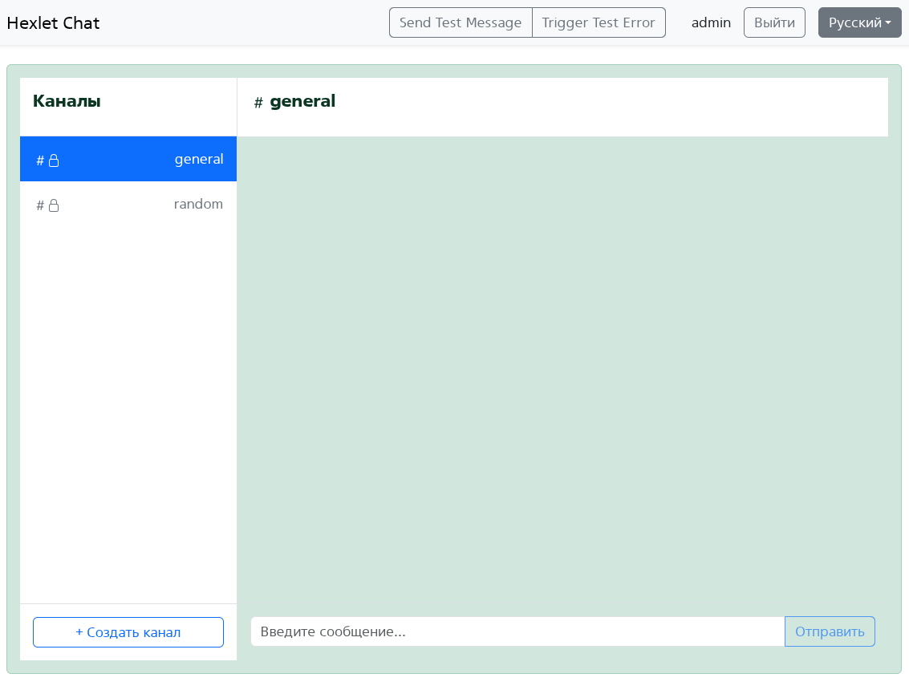
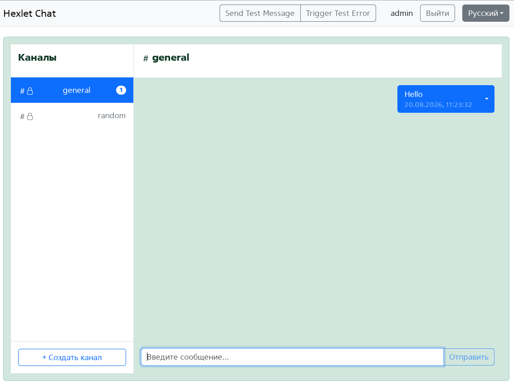
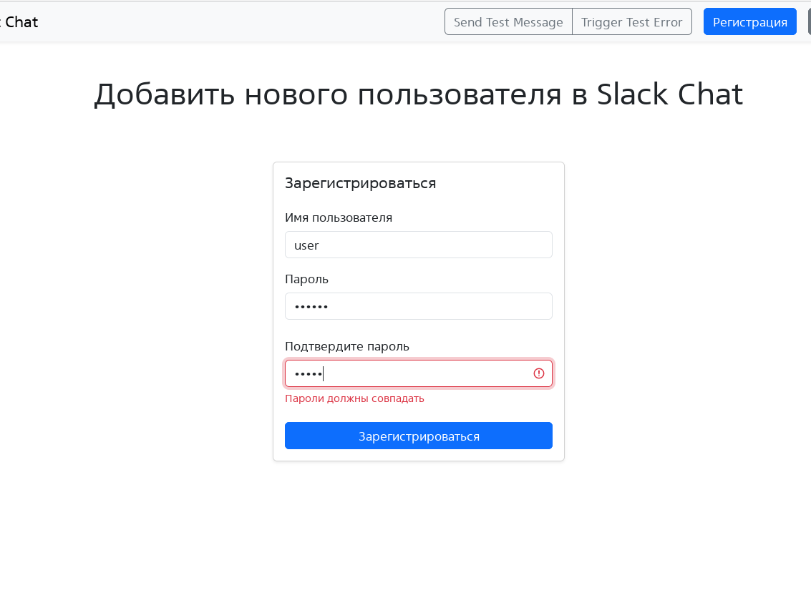
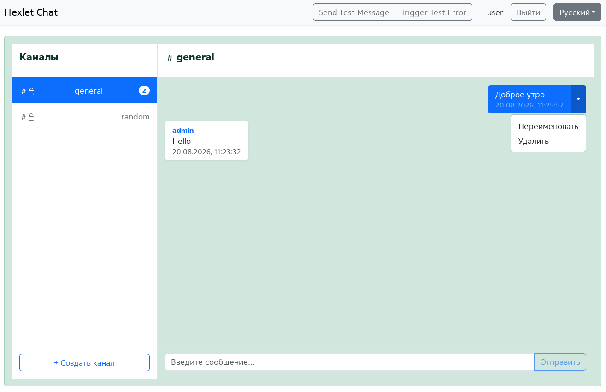
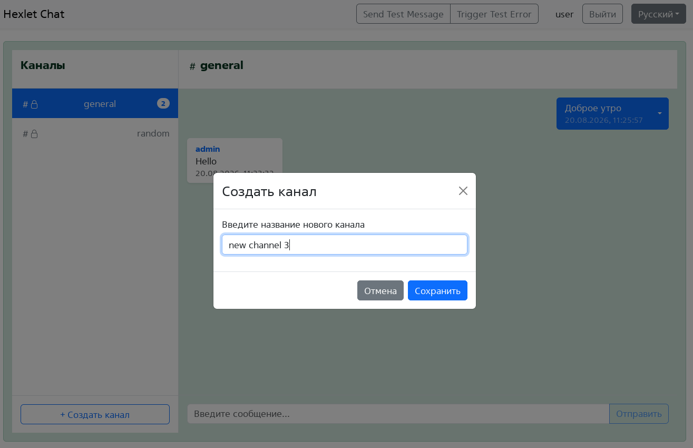
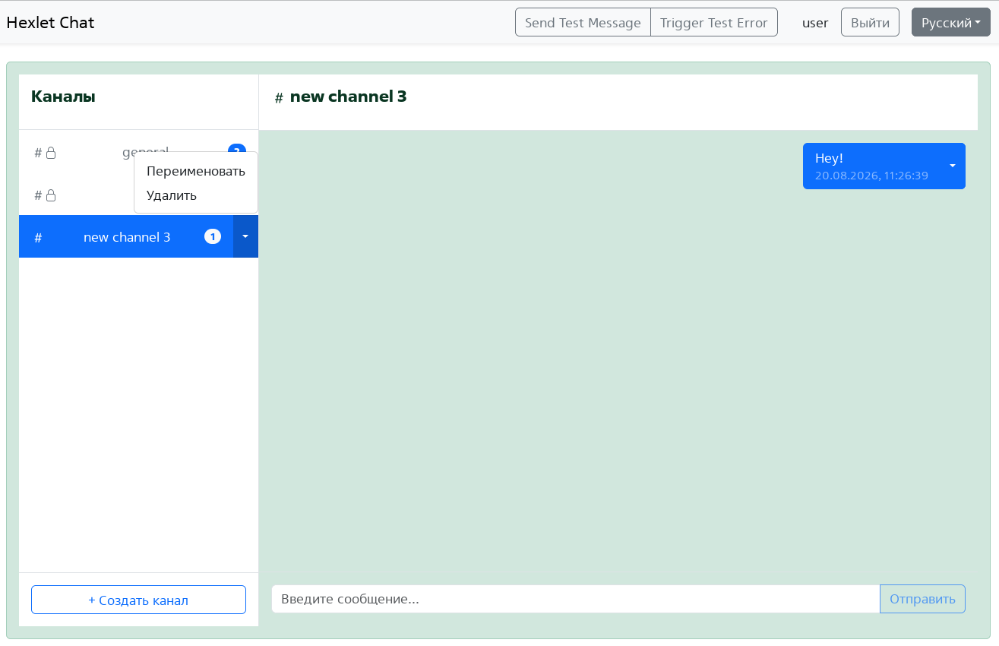

### Hexlet tests and linter status:

### Аналог Slack-чата (очень упрощённая версия)

Build Command npm ci && npm run build
Start Command npm start

https://slack-chat-s4om.onrender.com/

start backend npx start-server -s ./frontend/dist
start frontend npm run dev

## Как это работает

